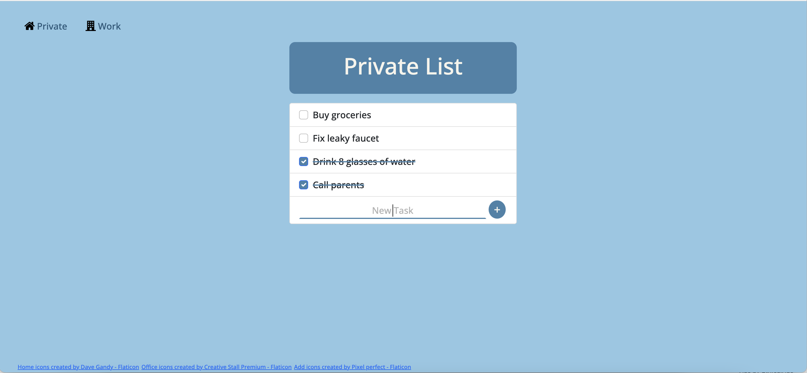

# todo-list
Simple and intuitive tool designed to help you manage your tasks efficiently, whether they are related to your private life or work responsibilities.
## Getting Started
1. Clone the Repository:
```
git@github.com:justynakantyka/todo-list.git
```
2. Install Dependencies:
```
npm i
```
3. Run the Application locally:
```
node index.js
```
4. Open your web browser and navigate to: http://localhost:3000

## Overview

### Screenshot


## My process

### Built with
* HTML
* CSS
* JavaScript
* EJS
* Bootstrap
