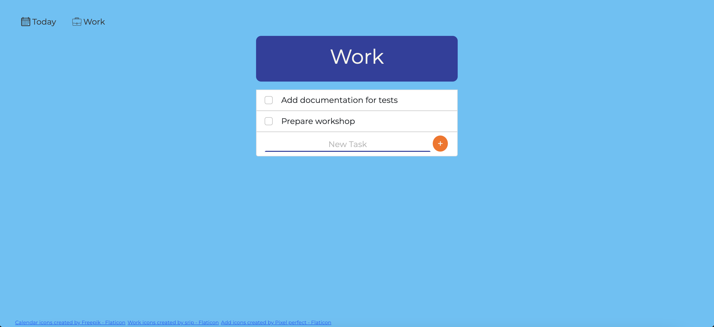

# todo-list
Simple and intuitive tool designed to help you manage your tasks efficiently, whether they are related to your private life or work responsibilities.

## Requirements
- Node.js 18 or Node.js 16 installed (To check node version run: `node -v` or `nvm version` (if you are using nvm))
- Npm installed (It should already be installed when you install Node.js. To check, run: `npm -v`)
- MongoDB Installed and Configured

## Getting Started
1. Clone the Repository:
```
git clone git@github.com:justynakantyka/todo-list.git
```
2. Go to the todo-list directory:
```
cd todo-list
```
3. Install Dependencies:
```
npm i
```
4. Run MongoDB server locally using command:
```
mongod
```
by default, mongodb server will start at port `27017` \
5. Run the Application locally :
```
node index.js
```
Application is connected to mongodb database: `todolistDB://localhost:27017/todolistDB` \
6. Open your web browser and navigate to: http://localhost:3000

## Overview

### Screenshot


## Built with
* HTML
* CSS
* JavaScript
* EJS
* Bootstrap
* Mongoose
* MongoDB

## To Do
- [ ] Add to do list for work/home
